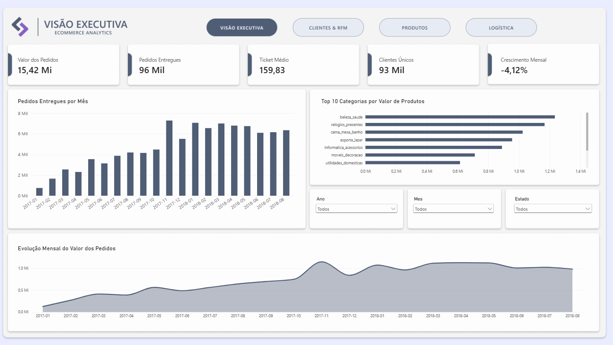
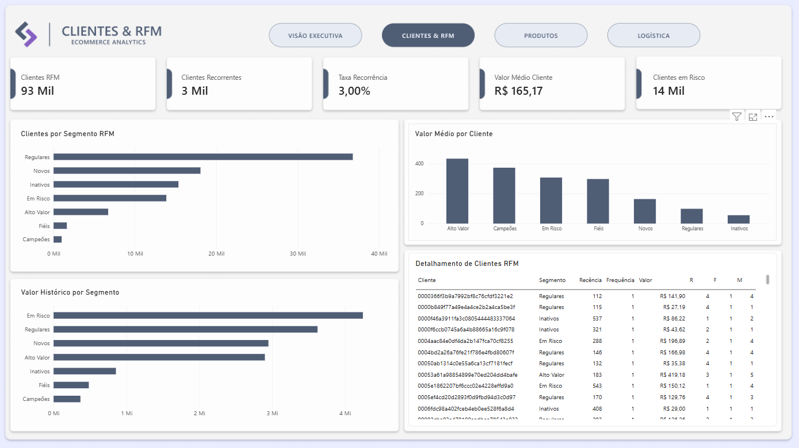
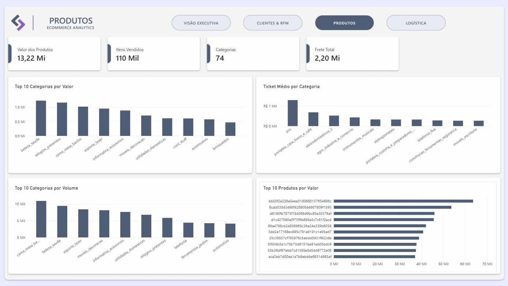
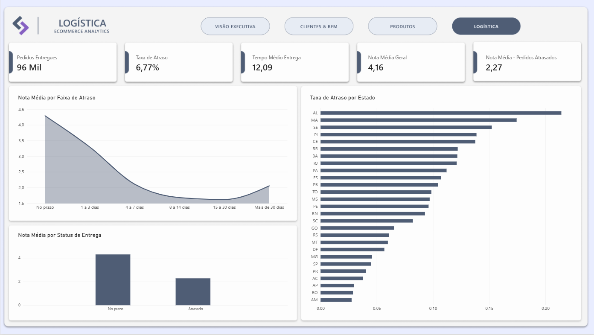

# Olist E-commerce Analytics

Projeto de **Análise de Dados e Business Intelligence** desenvolvido a partir do dataset público da Olist, com o objetivo de simular um fluxo real de trabalho de um Analista de Dados: ingestão e validação dos dados, análises em SQL, exploração com Python, modelagem e construção de dashboards no Power BI.

O projeto transforma dados transacionais de e-commerce em **indicadores, segmentações e insights de negócio** relacionados a vendas, clientes, produtos, logística e satisfação.

---

## 📌 Objetivos do projeto

As análises foram desenvolvidas para responder perguntas como:

- Como as vendas evoluíram ao longo do tempo?
- Qual o valor total movimentado e o ticket médio?
- Qual o nível de recorrência dos clientes?
- Quais clientes possuem maior valor para o negócio?
- Quais clientes apresentam maior risco de perda?
- Quais categorias e produtos possuem maior relevância comercial?
- Quais regiões apresentam maior incidência de atrasos?
- Qual a relação entre atraso de entrega e avaliação do cliente?

---

## 🛠️ Tecnologias utilizadas

- **Oracle Database**
- **Oracle SQL**
- **DBeaver**
- **Python**
- **Pandas**
- **Matplotlib**
- **Jupyter Notebook**
- **Power BI**
- **DAX**
- **Git / GitHub**

---

## 📂 Estrutura do projeto

```text
olist-ecommerce-analytics/
│
├── data/
│   ├── raw/
│   └── processed/
│
├── sql/
│   ├── 00_create_staging_tables.sql
│   ├── 01_data_quality.sql
│   ├── 02_analytics_sales.sql
│   ├── 03_analytics_customers.sql
│   ├── 04_analytics_logistics.sql
│   └── 05_analytics_products.sql
│
├── python/
│   ├── 01_prepare_reviews.py
│   └── 02_eda.ipynb
│
├── powerbi/
│   └── olist_ecommerce_analytics.pbix
│
├── images/
│   ├── dashboard_executivo.png
│   ├── dashboard_clientes.png
│   ├── dashboard_produtos.png
│   └── dashboard_logistica.png
│
└── README.md
```

> **Observação:** os arquivos brutos do dataset podem ser mantidos fora do repositório caso ultrapassem o limite de tamanho do GitHub. Nesse caso, a pasta `data/raw/` pode conter apenas instruções para download.

---

## 🔄 Pipeline do projeto

```text
CSVs
  ↓
Oracle Database
  ↓
Validação e qualidade dos dados
  ↓
SQL Analytics
  ↓
Python / EDA
  ↓
Power BI
  ↓
Insights e recomendações
```

---

# 1. Qualidade dos dados

Antes das análises, foram realizadas verificações de qualidade para garantir a consistência das informações utilizadas.

### Volume das principais tabelas

| Tabela | Registros |
|---|---:|
| Customers | 99.441 |
| Orders | 99.441 |
| Order Items | 112.650 |
| Payments | 103.886 |
| Reviews | 99.224 |
| Products | 32.951 |
| Sellers | 3.095 |

Também foram verificadas:

- duplicidades;
- registros órfãos;
- valores nulos;
- integridade entre pedidos, clientes, itens e produtos;
- distribuição dos status dos pedidos;
- distribuição das avaliações.

Nas principais validações utilizadas no projeto, não foram identificadas duplicidades ou registros órfãos relevantes.

### Status dos pedidos

| Status | Pedidos |
|---|---:|
| Delivered | 96.478 |
| Shipped | 1.107 |
| Canceled | 625 |
| Unavailable | 609 |
| Invoiced | 314 |
| Processing | 301 |
| Created | 5 |
| Approved | 2 |

### Distribuição das avaliações

| Nota | Avaliações | % |
|---|---:|---:|
| 1 | 11.424 | 11,51% |
| 2 | 3.151 | 3,18% |
| 3 | 8.179 | 8,24% |
| 4 | 19.142 | 19,29% |
| 5 | 57.328 | 57,78% |

---

# 2. Dashboard — Visão Executiva



A página executiva concentra os principais indicadores do negócio e a evolução mensal das vendas.

### Principais KPIs

- **R$ 15,42 milhões** em valor total de pedidos entregues;
- aproximadamente **96 mil pedidos entregues**;
- **ticket médio de R$ 159,83**;
- aproximadamente **93 mil clientes únicos**;
- crescimento de **-4,12%** no último mês disponível em relação ao mês anterior.

A evolução mensal mostra forte crescimento ao longo de 2017 e um período de maior estabilidade em 2018.

---

# 3. Clientes & RFM



A análise de clientes foi construída utilizando `customer_unique_id`, permitindo identificar o comportamento real de recompra.

### Recorrência

- Clientes únicos analisados: **93.358**
- Clientes de compra única: **90.557**
- Clientes recorrentes: **2.801**
- Taxa de recorrência: aproximadamente **3%**

Clientes recorrentes representam uma parcela pequena da base, mas apresentam valor médio significativamente superior.

| Tipo de cliente | Clientes | Valor histórico | Valor médio por cliente |
|---|---:|---:|---:|
| Compra única | 90.557 | R$ 14,56 mi | R$ 160,73 |
| Recorrente | 2.801 | R$ 864 mil | R$ 308,53 |

## Segmentação RFM

Foi criada uma segmentação utilizando:

- **Recency** — tempo desde a última compra;
- **Frequency** — quantidade de compras;
- **Monetary** — valor total movimentado pelo cliente.

| Segmento | Clientes | % da base | Valor histórico | Valor médio |
|---|---:|---:|---:|---:|
| Em Risco | 13.855 | 14,84% | R$ 4,24 mi | R$ 306,36 |
| Regulares | 36.778 | 39,39% | R$ 3,62 mi | R$ 98,47 |
| Novos | 18.051 | 19,34% | R$ 2,95 mi | R$ 163,30 |
| Alto Valor | 6.709 | 7,19% | R$ 2,90 mi | R$ 432,15 |
| Inativos | 15.347 | 16,44% | R$ 855 mil | R$ 55,72 |
| Fiéis | 1.628 | 1,74% | R$ 483 mil | R$ 296,77 |
| Campeões | 990 | 1,06% | R$ 368 mil | R$ 372,04 |

### Insight

O segmento **Em Risco** representa apenas **14,84% da base**, mas concentra aproximadamente **R$ 4,24 milhões em valor histórico**. Isso indica uma oportunidade relevante para estratégias de retenção e reativação.

---

# 4. Análise de Pareto

A análise de concentração de receita mostrou que o valor movimentado está relativamente distribuído entre a base de clientes.

Para atingir aproximadamente:

- **50% do valor**, são necessários cerca de **17,3% dos clientes**;
- **80% do valor**, cerca de **48,9% dos clientes**;
- **90% do valor**, cerca de **66,8% dos clientes**.

O resultado indica que a receita não depende exclusivamente de um pequeno grupo de clientes.

---

# 5. Produtos



A página de produtos compara desempenho por valor, volume e ticket médio.

### Principais resultados

**Categoria com maior valor total:** `beleza_saude` — aproximadamente **R$ 1,41 milhão** considerando produtos e frete.

**Categoria com maior volume:** `cama_mesa_banho` — aproximadamente **10.953 itens vendidos**.

**Categoria com maior ticket médio entre categorias com volume mínimo relevante:** `pcs` — aproximadamente **R$ 1.290 por pedido**.

A categoria `relogios_presentes` também apresenta desempenho relevante por combinar alto valor total, volume significativo e ticket médio elevado.

### Insight

As categorias líderes em volume não são necessariamente as mesmas que lideram em valor ou ticket médio. Isso reforça a importância de analisar múltiplos indicadores simultaneamente.

---

# 6. Logística & Satisfação



A análise logística revelou uma forte associação entre prazo de entrega e avaliação do cliente.

### Indicadores gerais

- aproximadamente **96 mil pedidos entregues**;
- **6,77%** de taxa de atraso considerando dias-calendário;
- **12,09 dias** de tempo médio de entrega;
- **4,16** de nota média geral;
- **2,27** de nota média entre pedidos classificados como atrasados.

## Nota média por faixa de atraso

| Faixa | Nota média |
|---|---:|
| No prazo | 4,29 |
| 1 a 3 dias | 3,29 |
| 4 a 7 dias | 2,10 |
| 8 a 14 dias | 1,68 |
| 15 a 30 dias | 1,62 |
| Mais de 30 dias | 2,05 |

A satisfação cai de forma acentuada já nos primeiros dias de atraso.

### Insight

Pedidos entregues no prazo apresentam avaliação média próxima de **4,29**, enquanto atrasos entre **15 e 30 dias** apresentam média de apenas **1,62**.

A faixa acima de 30 dias possui menor volume de registros e, por isso, deve ser interpretada com cautela.

## Análise geográfica

Alguns estados apresentaram taxas de atraso superiores à média.

Entre os destaques estão:

- AL
- MA
- PI
- CE
- SE
- BA
- RJ

O **Rio de Janeiro** merece atenção especial por combinar volume elevado de pedidos com uma taxa de atraso relevante.

---

# 7. Análise Exploratória com Python

O Python foi utilizado como complemento às análises realizadas em SQL, principalmente para explorar distribuições e visualizar padrões.

Foram analisados:

- distribuição do valor dos pedidos;
- distribuição do prazo de entrega;
- valores extremos;
- atraso x avaliação;
- comportamento de clientes recorrentes.

### Valor dos pedidos

- Média: **R$ 159,83**
- Mediana: **R$ 105,28**
- Máximo: **R$ 13.664,08**

A diferença entre média e mediana evidencia uma distribuição assimétrica, com poucos pedidos de alto valor elevando a média.

### Tempo de entrega

- Média: **12,09 dias**
- Mediana: **10 dias**
- Máximo: **209 dias**

Também foram observados casos extremos de entrega.

---

# 8. Principais insights de negócio

### 1. Retenção representa uma oportunidade relevante

A taxa de recorrência é de aproximadamente **3%**, indicando grande espaço para estratégias voltadas à segunda compra.

Clientes recorrentes possuem valor médio por cliente substancialmente superior ao de clientes de compra única.

### 2. Clientes em risco devem ser priorizados

O grupo **Em Risco** concentra cerca de **R$ 4,24 milhões** em valor histórico.

Ações direcionadas a esse segmento podem ter impacto relevante na retenção de receita.

### 3. Atrasos estão fortemente associados à pior satisfação

Mesmo com uma taxa geral de atraso relativamente baixa, a diferença de avaliação entre pedidos no prazo e atrasados é expressiva.

A queda de satisfação se intensifica conforme os dias de atraso aumentam.

### 4. Volume e valor contam histórias diferentes

Categorias de maior volume não são necessariamente as categorias de maior valor ou maior ticket médio.

Decisões comerciais devem considerar diferentes métricas simultaneamente.

### 5. O problema logístico não está distribuído de forma uniforme

Alguns estados concentram taxas de atraso maiores, indicando oportunidades para investigações operacionais e ações regionais.

---

# 9. Recomendações

A partir das análises realizadas, algumas ações de negócio possíveis seriam:

- criar campanhas específicas para clientes classificados como **Em Risco**;
- desenvolver estratégias para aumentar a segunda compra de clientes novos;
- monitorar estados com maior incidência de atrasos;
- investigar causas operacionais nas regiões críticas;
- acompanhar categorias considerando volume, valor e ticket médio;
- criar alertas para pedidos próximos ou acima da data estimada de entrega;
- acompanhar periodicamente a evolução da taxa de recorrência.

---

# 10. Dashboard Power BI

O dashboard foi desenvolvido em **Power BI** e possui quatro páginas:

### 01 — Visão Executiva
KPIs gerais, evolução das vendas e principais categorias.

### 02 — Clientes & RFM
Recorrência, segmentação RFM, valor histórico e detalhamento de clientes.

### 03 — Produtos
Valor, volume, ticket médio e produtos de maior desempenho.

### 04 — Logística
Taxa de atraso, prazo de entrega, satisfação e análise geográfica.

O arquivo `.pbix` está disponível em:

```text
powerbi/olist_ecommerce_analytics.pbix
```

---

# 11. Competências demonstradas

Este projeto demonstra competências relacionadas a uma posição de **Analista de Dados / BI**, incluindo:

- SQL analítico;
- CTEs;
- joins;
- funções de janela;
- `ROW_NUMBER`;
- `LAG`;
- `NTILE`;
- análise de Pareto;
- segmentação RFM;
- validação e qualidade de dados;
- modelagem de dados;
- Python com Pandas;
- análise exploratória;
- visualização de dados;
- Power BI;
- DAX;
- modelagem de relacionamentos;
- criação de KPIs;
- análise de negócio;
- storytelling com dados.

---

# 12. Sobre o dataset

Os dados utilizados são provenientes do dataset público **Brazilian E-Commerce Public Dataset by Olist**, disponibilizado no Kaggle.

O conjunto possui informações sobre:

- pedidos;
- clientes;
- itens;
- produtos;
- vendedores;
- pagamentos;
- avaliações;
- entregas.

---

## 📄 Licença e uso

Este projeto foi desenvolvido exclusivamente para fins de estudo e portfólio, utilizando um dataset público.
